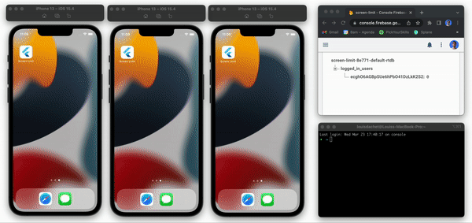

# Screen Limit app

A project to show how to prevent simultaneous login of the same user using Firebase Realtime Database and Flutter.

## Getting Started

Clone this repository and run `flutter run`.
Create an account and test to log in on more than 2 devices, you should get a pop up that indicates you that you're not allowed to use more than 2 screens at the same time.

This project uses Firebare authentication, Firebase Realtime Database and Bloc for the state managment. 

You can check the commit [Add screen limit](https://github.com/Cteq3132/screen-limit/commit/fa5b4c2110ec9f5569cc0e126aa78e03eb28a1c7) to see the lines to add for this feature from an app with an authentication feature (here done with bloc and firebase) [Basic app with auth](https://github.com/Cteq3132/screen-limit/commit/e3bc221d98e00d465475cb473fd4323fea19581f).